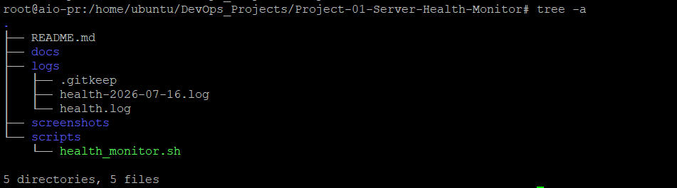
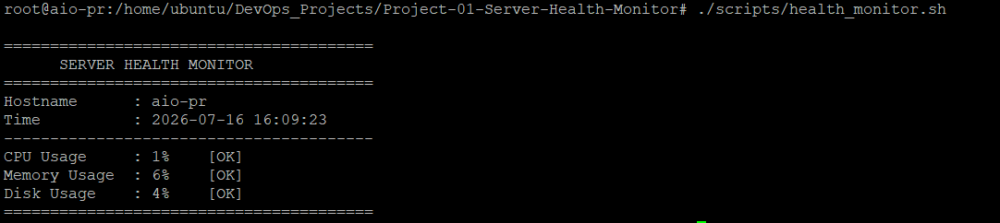
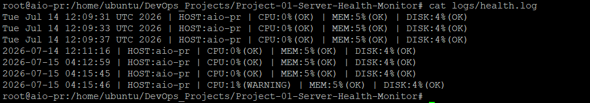
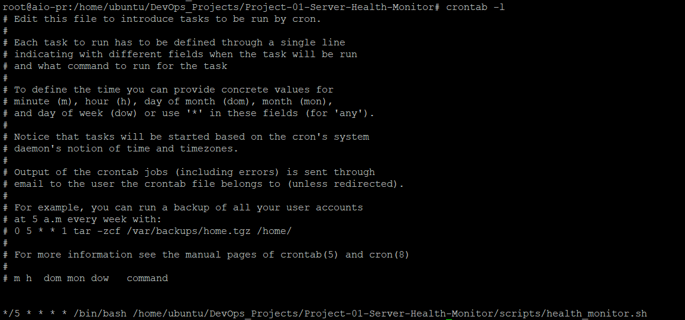
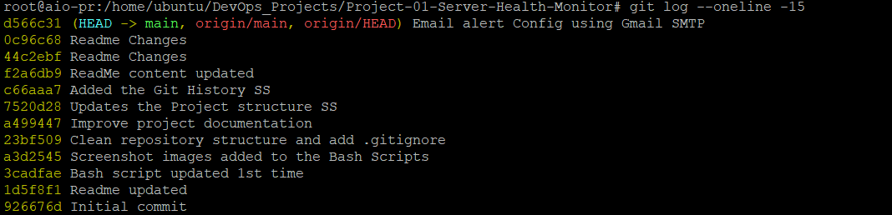

# Server Health Monitor

A Bash scripting project that monitors server health on a Linux machine.

## Features

- CPU Usage Monitoring
- Memory Usage Monitoring
- Disk Usage Monitoring
- Warning Thresholds
- Timestamped Logs
- Daily Log Files
- Cron Automation
- Email Alert Support (Postfix)

## Technologies

- Bash
- Linux
- Cron
- Postfix
- Mailutils

## Project Structure

```
Project-01-Server-Health-Monitor/
│
├── scripts/
│   └── health_monitor.sh
│
├── logs/
│   └── .gitkeep
│
├── screenshots/
│
└── README.md
```

## Run

```bash
chmod +x scripts/health_monitor.sh
./scripts/health_monitor.sh
```

## Sample Output
```text
========================================
      SERVER HEALTH MONITOR
========================================
Hostname      : aio-pr
Time          : 2026-07-14 12:11:16
----------------------------------------
CPU Usage     : 0%    [OK]
Memory Usage  : 5%    [OK]
Disk Usage    : 4%    [OK]
========================================

## Screenshots

### Project Structure



### Script Output



### Log File



### Cron Job



---

## Git Commit History

This project follows a proper Git workflow with multiple commits during development.


