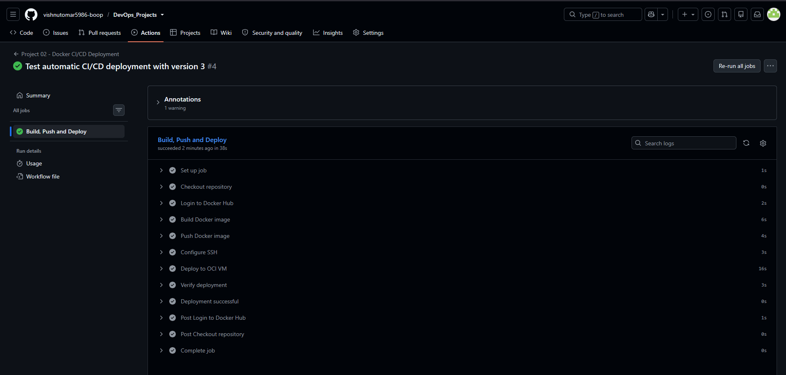
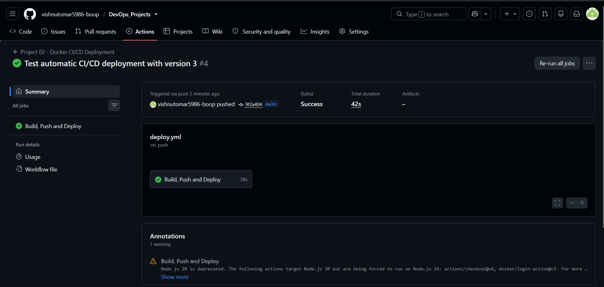
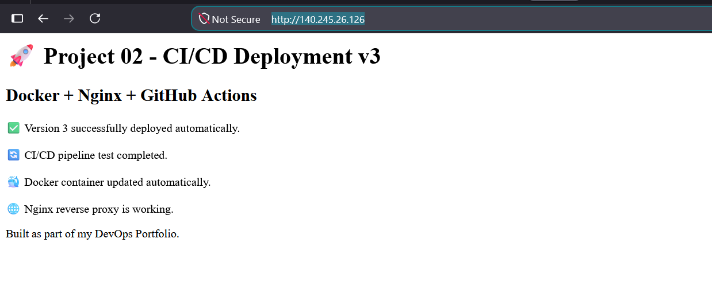
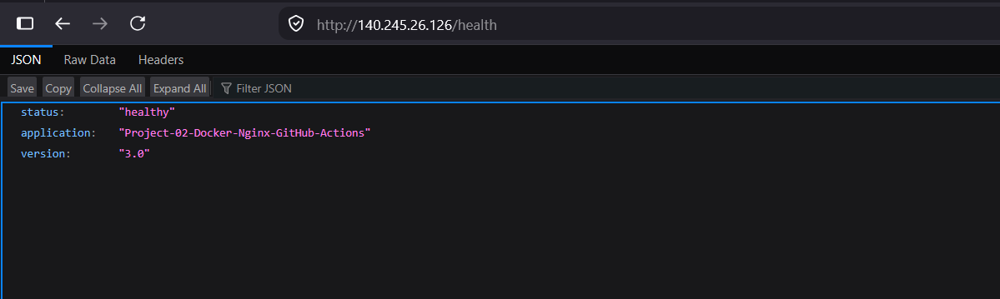
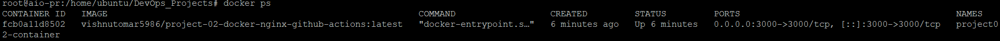
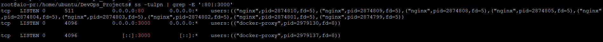

# Project 02 - Docker, Nginx & GitHub Actions CI/CD Pipeline

## Overview

This project demonstrates an automated CI/CD pipeline for deploying a containerized Node.js application to an Ubuntu Virtual Machine hosted on Oracle Cloud Infrastructure (OCI).

The pipeline automatically builds the Docker image, pushes it to Docker Hub, connects securely to the OCI VM using SSH, pulls the latest image, replaces the running container, and verifies the deployment through a health-check endpoint.

Nginx is used as a reverse proxy so that external HTTP traffic reaches the Node.js application running inside the Docker container.

---

## Architecture

```text
Developer
    |
    | git push
    v
GitHub Repository
    |
    | GitHub Actions
    v
+-----------------------------+
| CI/CD Pipeline              |
|                             |
| 1. Checkout repository      |
| 2. Login to Docker Hub      |
| 3. Build Docker image       |
| 4. Push image               |
| 5. Configure SSH            |
| 6. Deploy to OCI VM         |
| 7. Verify deployment        |
+-------------+---------------+
              |
              | SSH
              v
       OCI Ubuntu VM
              |
              v
       Docker Container
        Node.js App
        127.0.0.1:3000
              ^
              |
         Nginx :80
              |
              v
          HTTP Client


---

## Deployment Evidence

The following screenshots provide visual evidence of the completed Project 02 deployment.

### GitHub Actions CI/CD Pipeline

The GitHub Actions workflow successfully completed the automated build, Docker image push, SSH configuration, OCI VM deployment, and deployment verification steps.



### GitHub Actions Workflow

The workflow demonstrates the complete CI/CD flow from repository push through Docker image build, Docker Hub push, SSH deployment, and verification.



### Application Homepage

The Node.js/Express application is successfully accessible through the Nginx reverse proxy on the OCI VM.



### Application Health Check

The `/health` endpoint confirms that the deployed application is healthy and running version `3.0`.



### Docker Container

The Docker container is running successfully using the image published to Docker Hub.



### Network and Port Validation

The server is listening on HTTP port `80` through Nginx, while the Dockerized application is running on port `3000`.



---

## Final Deployment Flow

```text
Developer
    |
    | git push
    v
GitHub Repository
    |
    v
GitHub Actions
    |
    +----> Build Docker Image
    |
    +----> Push Image to Docker Hub
    |
    +----> Configure SSH
    |
    +----> Connect to OCI VM
    |
    +----> Run Deployment Script
    |
    +----> Pull Latest Docker Image
    |
    +----> Replace Running Container
    |
    +----> Verify Deployment
    |
    v
OCI Ubuntu VM
    |
    v
Nginx :80
    |
    v
Docker Container :3000
    |
    v
Node.js / Express Application
